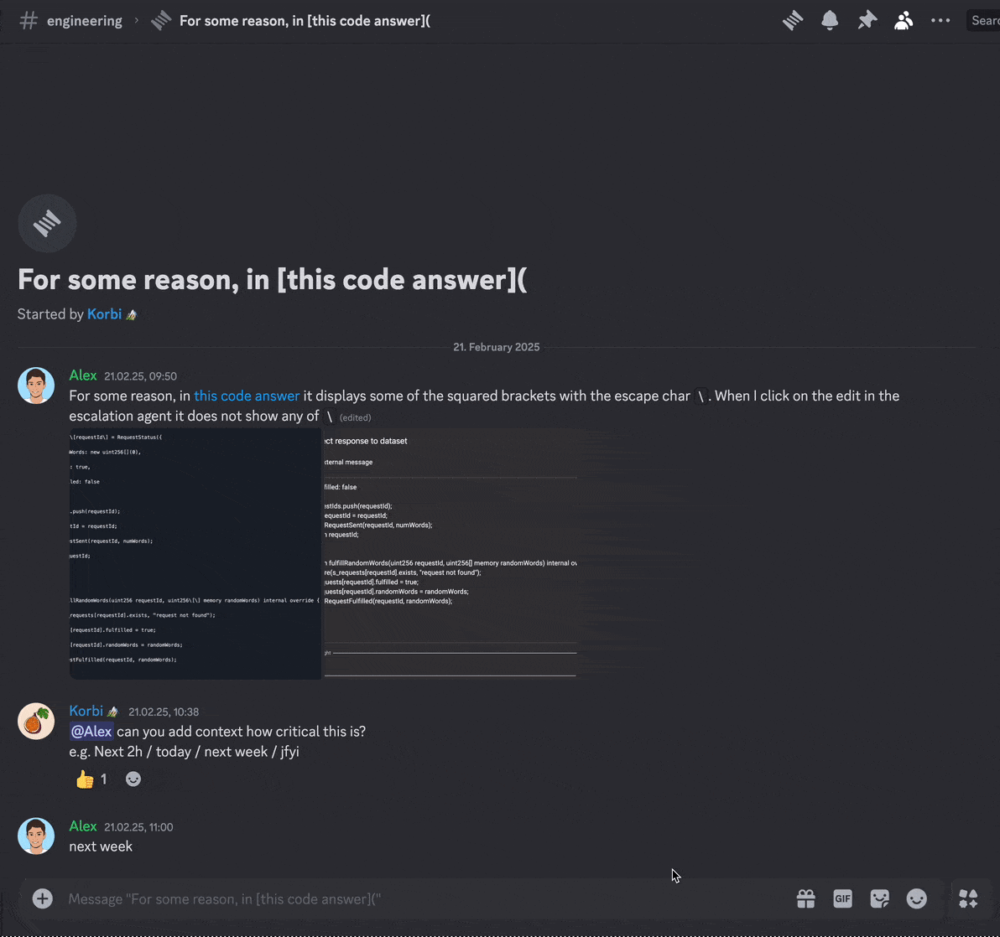

# Create AI based Linear issues from Discord

Use the `/autoissue` command on Discord, then the bot reads the conversation context to generate a meaningful issue title and description.

The AI automatically prefills title, description, priority, and assignee.

## Installation

If you'd like to use a hosted version of this bot, [please let me know](mailto:korbi+discordlinear@pluno.ai) and I'll create one if there's interest.

## Setup for self-hosting (10 minutes)

You'll need to setup the Discord bot, authorize Linear, and provide an OpenAI API key.

1. **Discord Bot Token:**
   - Go to [Discord Developer Portal](https://discord.com/developers/applications)
   - Create a New Application
   - Bot setup:
     - Go to the `Bot` section of the application
     - Under `Privileged Gateway Intents`, enable `Message Content Intent`
     - Copy the bot token from `Bot -> Reset Token -> Copy`
     - Add the bot token to `.env` as `DISCORD_TOKEN`
   - Permission setup:
      - Go to the `Installation` section
      - Under `Guild Install -> Scopes`, add `applications.commands` and `bot`
      - Under `Guild Install -> Permissions`, enable:
         - `View Channels`
         - `Use Slash Commands`
         - `Read Message History`
         - `Send Messages`
         - `Send Messages in Threads`
         - `Embed Links`
      - Copy installation link from `Installation -> Install Link -> Copy`
      - Invite the bot to your server using the link

2. **Linear Access Token:**
   - Create application in Linear
      - Go to settings (`G` then `S`)
      - Under `Administration -> API`, create a new OAuth application
      - For the redirect URI, use `http://localhost:3000/callback`
      - Under `OAuth credentials -> Developer token`, click `Create & copy token`
      - Copy the token to `.env` as `LINEAR_ACCESS_TOKEN`
   
3. **OpenAI API Key:**
   - Set the `OPENAI_API_KEY` in `.env`

4. **Run the bot:**
   - Run `make setup`
   - Run `make run`

## Usage

1. In any channel, use the `/autoissue` command
2. The bot will:
   - Fetch recent messages from the channel
   - Generate a title and description using AI
   - Create a Linear issue in your default team
   - Return a link to the created issue

## That's it! :tada:
